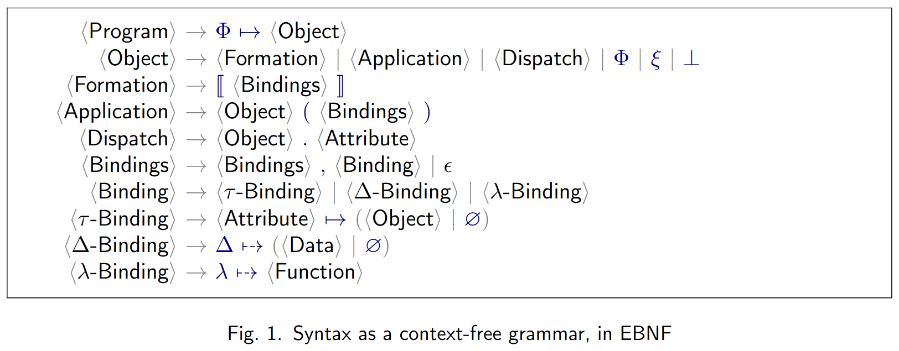

# `normalizer metrics`

## PHI grammar



## Metrics

We count:

- [Object applications](#object-applications)
- [Object formations](#object-formations)
- [Dynamic dispatches](#dynamic-dispatches)
- [Dataless formations](#dataless-formations)

### Object formations

- `⟦ d ↦ ∅, c ↦ ∅ ⟧`

### Object applications

- `ξ.b(c ↦ ⟦ ⟧)`

### Dynamic dispatches

- `ξ.ρ.c`

### Dataless formations

#### Definition: \\( \Delta \\)-depth

\\( \Delta \\)-depth of an object describes how deep data is in the object
when recursively traversing values attached to the object attributes. That is, \\( \Delta \\)-depth is \\( \infty \\)
for all objects except formations. More specifically:

1. the \\( \Delta \\)-depth of a formation with bytes attached to a \\( \Delta \\)-attribute is \\( 1 \\)-;
1. for a non-empty formation, the \\( \Delta \\)--depth is:
   1. \\( 1 + M \\), where \\( M \\) is the minimal depth among objects attached to attributes of this formation;
   1. \\( \infty \\) if there are no objects attached to attributes of this formation;
1. otherwise, the \\( \Delta \\)-depth of an object is \\( \infty \\).

#### Definition: Dataless object

An object is dataless if its \\( \Delta \\)-depth is greater than 2.

#### Examples

The following table demonstrates objects with their \\( \Delta \\)-depths:


## Environment

{{#include ../common/sample-program.md}}

## CLI

### `--help`

```$ as console
normalizer metrics --help
```

```console
Usage: normalizer metrics [FILE] [-o|--output-file FILE]
                          [-b|--bindings-path PATH]

  Collect metrics for a PHI program.

Available options:
  FILE                     FILE to read input from. When no FILE is specified,
                           read from stdin.
  -o,--output-file FILE    Output to FILE. When this option is not specified,
                           output to stdout.
  -b,--bindings-path PATH  Report metrics for bindings of a formation accessible
                           in a program by the PATH. When this option is not
                           specified, metrics for bindings are not reported.
                           Example of a PATH: 'org.eolang'.
  -h,--help                Show this help text
```

### `FILE`

```$ as json
normalizer metrics program.phi
```

```json
{
  "bindings-by-path-metrics": null,
  "program-metrics": {
    "applications": 1,
    "dataless": 5,
    "dispatches": 4,
    "formations": 5
  }
}
```

### `FILE` not specified (read from stdin)

```$ as json
cat program.phi | normalizer metrics
```

```json
{
  "bindings-by-path-metrics": null,
  "program-metrics": {
    "applications": 1,
    "dataless": 5,
    "dispatches": 4,
    "formations": 5
  }
}
```

### `--bindings-path`

```$ as console
normalizer metrics --bindings-path "a" program.phi
```

```console
{
  "bindings-by-path-metrics": {
    "bindings-metrics": [
      {
        "metrics": {
          "applications": 0,
          "dataless": 2,
          "dispatches": 2,
          "formations": 2
        },
        "name": "b"
      },
      {
        "metrics": {
          "applications": 1,
          "dataless": 1,
          "dispatches": 2,
          "formations": 1
        },
        "name": "e"
      }
    ],
    "path": "a"
  },
  "program-metrics": {
    "applications": 1,
    "dataless": 5,
    "dispatches": 4,
    "formations": 5
  }
}
```
